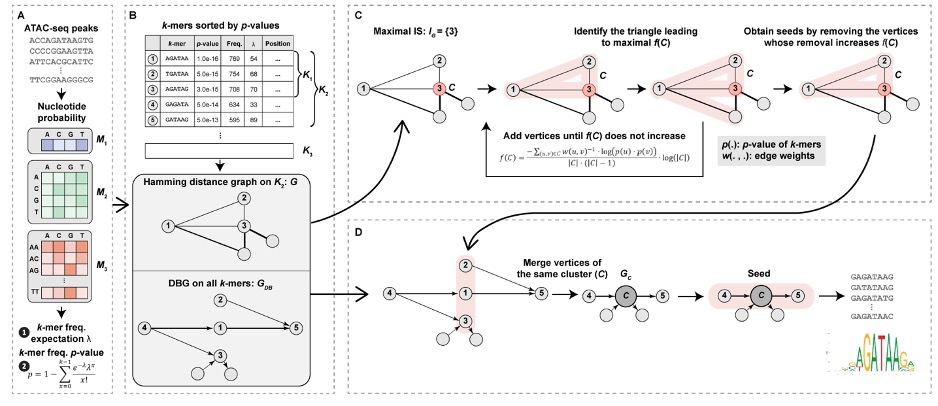

# CEMIG (Cis rEgulatory Motif Influence using de Bruijn Graph)

## Overview

CEMIG is a new motif prediction algorithm which takes k-mer as the basic unit, finds motif seeds by introducing hash table and describing the relationship between k-mers constituting motif by using de Bruijn graph model, and then merges and extends among motif seeds, so as to more accurately predict the transcriptional motifs in ATAC-seq data.



Figure showns the illustration of the CEMIG framework. (A) Determines the P-values of k-mers in background data utilizing Markov models. (B) Constructs Hamming distance graph (G) and DBG (G_DB) graphs using k-mers. (C) Clusters k-mers on G to form G_C, merging same-cluster k-mers from G_DB. (D) Identifies motifs via path extension in G_C.

## Sequence set

The sequence set refers to the collection of DNA sequences that are used as input data for motif discovery algorithms. The sequence set is specifically derived from ChIP-seq data or ATAC-seq data. The ChIP-seq data usually includes a narrow peak file in `FASTA` format. For ATAC-seq data, either a narrow peak file or a footprint file in `FASTA` format is used as input for the CEMIG algorithm to identify DNA binding motifs.

## Installation

Enter the folder `code` and type `make` then the compiled codes are within the same directory as the source.

```
cd code/
make clean && make
```

## Motif Prediction

```
cd code/
./cemig -i test.fa
```

| Arguments                  | Description                                                               |
| -------------------------- | ------------------------------------------------------------------------- |
| --InputFile(-I)            | Input file with standard FASTA file format in default                     |
| --GenomeFile(-G)           | Genome files with standard FASTA file format                              |
| --OutFileNamePrefix(-O)    | Number of flanking base pairs at each side of peak summit (default is 50) |
| --Paired-end(-P)           | Whether the input data is paired-end (true in defalut)                    |
| --MaxMotifs                | Maximum number of output motifs (100 in default)                          |

## Citation
